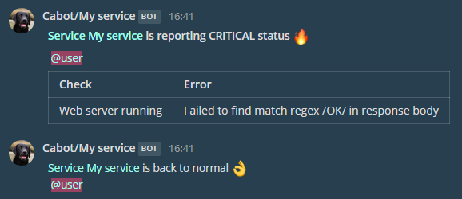

Cabot Mattermost Plugin
=====

This is an alert plugin for the [Cabot service monitoring tool](https://github.com/arachnys/cabot).
It allows you to alert users by their user handle in a Mattermost channel.



*Tested with Cabot 0.11.9 only.*

## Installation

Install using pip:

```
    $ pip install https://github.com/jazzzz/cabot-alert-mattermost/archive/1.0.1.zip
```

Edit `conf/production.env` in your Cabot clone to include the plugin:

```
CABOT_PLUGINS_ENABLED=cabot_alert_mattermost,<other plugins>...
```

## Configuration

The plugin requires the `MATTERMOST_WEBHOOK_URL` variable to be set:

```
MATTERMOST_WEBHOOK_URL=mattermost_incoming_webhook_url
```

These variables are optional:

```
MATTERMOST_ALERT_CHANNEL=channel_name
MATTERMOST_ICON_URL=https://raw.github.com/jazzzz/cabot-alert-mattermost/master/cabot.jpg
```
